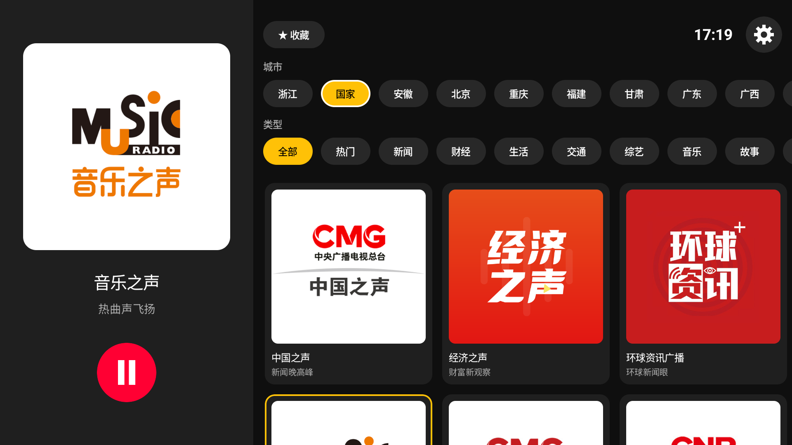
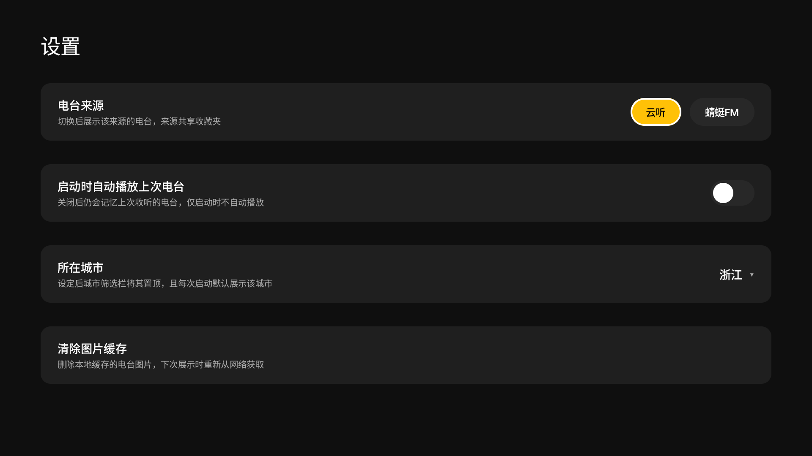

# 云听大屏版 · YuntingTV

一款专为**电视 / 电视盒子**打造的网络广播（电台）应用，用遥控器就能收听全国广播电台。同时兼容手机、平板。

聚合 **云听** 与 **蜻蜓FM** 两大来源，界面为大屏和遥控器操作优化，简洁、专注、够用。

---

## 📸 软件截图

|                      主界面 · 电台浏览与播放                       |                              设置                              |
|:--------------------------------------------------------:|:------------------------------------------------------------:|
|  |  |

---

## ✨ 功能

- 📻 **双来源电台** —— 云听、蜻蜓FM 一键切换，各自独立的电台列表
- 🌏 **按城市筛选** —— 全国台 + 各省市地方台，快速定位想听的频率
- 🏷️ **按分类筛选** —— 新闻、音乐、交通、戏曲等分类浏览
- ⭐ **收藏夹** —— 收藏常听电台，两个来源的收藏合并展示，节目单自动刷新
- 🔊 **后台播放** —— 息屏、切到别的应用照样听，通知栏可控制
- ⏯️ **记忆上次收听** —— 可设置开机（启动）自动续播上次的电台
- 🏙️ **默认城市** —— 设定所在城市后，每次打开自动置顶你本地的台
- 🕐 **时钟显示** —— 大屏上随时看时间

## 📱 兼容性

| 项 | 要求 |
| --- | --- |
| 系统 | Android 9.0（API 28）及以上 |
| 设备 | 电视 / 电视盒子、手机、平板均可 |
| 操作 | 遥控器方向键、触屏皆可 |

## 📥 下载安装

**方式一 · GitHub Releases**

前往 [**Releases**](../../releases) 页面下载最新的 `.apk`：

- 电视盒子：用「当贝市场 / 文件管理器 / U盘」把 APK 拷进去安装
- 手机安装后可直接使用，或投屏到电视

**方式二 · 小草助手**

打开 [小草助手（yecao.app）](https://yecao.app/)，输入口令 **`R2B1`** 即可下载。


## ⚙️ 从源码构建

```bash
git clone https://github.com/Uynaity/YuntingTV.git
cd YuntingTV
./gradlew assembleRelease
```

技术栈：Kotlin · Jetpack Compose for TV · Media3（ExoPlayer + MediaSession）· DataStore · Retrofit。

---

## ⚠️ 声明

本项目仅供学习与个人使用。电台内容版权归各来源平台（云听、蜻蜓FM）及广播机构所有，请勿用于商业用途。
